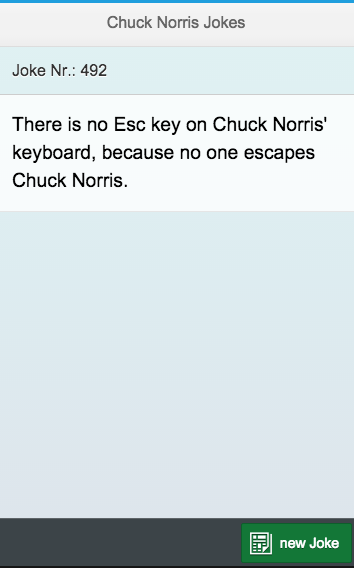

# Chuck Norris Jokes SAPUI5 App

This app is powered by the [Internet Chuck Norris Database API]. It displays a random Chuck Norris nerdy joke and the values are escaped for JavaScript usage. This is achieved with the following API call:

```javascript
http://api.icndb.com/jokes/random?limitTo=[nerdy]&escape=javascript
```
The app was created by [Denise Nepraunig] in September 2015. You can follow me on twitter [@denisenepraunig].

## Aplication Info
The application was build with [SAP] technology and was developed with my free [trial account].



## Technical info
- [SAPUI5] (1.30) app
- hosted on [HANA Cloud Platform] (HCP)
- deployed as **HTML5 application** on HCP
- uses **destination service** from HCP to access the API
- build with [SAP Web IDE]


## Deploying to your HCP trial account
The fastest way to deploy this application is the following:

- zip this **chuck_norris_jokes** folder
- import the **chucknorrisjokes** file in your HCP cockpit -> **Destinations**
- start your **SAP Web IDE** in the HCP cockpit -> **Subscriptions**
- in the SAP Web IDE home screen choose **Import** -> **Archive**
- right click the new folder and choose **Deploy** --> Deploy to *SAP HANA Cloud Platform**
- click **Deploy** in the dialog
- click on the **Open the active version...**
- DONE! ;-)

[Internet Chuck Norris Database API]: http://www.icndb.com/api/
[Denise Nepraunig]: http://www.nepraunig.com/
[@denisenepraunig]: https://twitter.com/denisenepraunig
[SAPUI5]: https://sapui5.hana.ondemand.com/sdk/index.html
[HANA Cloud Platform]: http://hcp.sap.com/index.html
[SAP]: https://www.sap.com
[SAP Web IDE]: http://scn.sap.com/docs/DOC-55465
[trial account]: https://account.hanatrial.ondemand.com/register