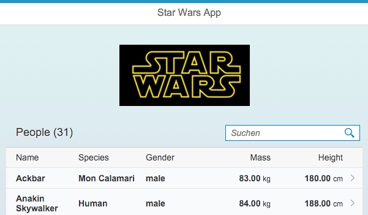

# Star Wars API (SWAPI) SAPUI5 App with mocked OData backend

This app is inspired by the [Star Wars API - SWAPI]. 

Currently it displays facts about the people. The backend ist currently mocked via tha [SAPUI5 Mockserver]. The modelling of the backend was done with HANAXS and the XSODATA service.

The app was created by [Denise Nepraunig] in March 2016. You can follow me on twitter [@denisenepraunig].

## Application Info
The application was build with [SAP] technology and was developed with my free [trial account].

```javascript
TODO: provide a blog post
```

[Open app].



## Technical info
- mobile first
- [SAPUI5] 1.34 app
- hosted on [HANA Cloud Platform] = HCP
- deployed as [HTML5 application] on HCP
- build with [SAP Web IDE]

[Star Wars API - SWAPI]: http://swapi.co/
[Denise Nepraunig]: http://www.nepraunig.com/
[@denisenepraunig]: https://twitter.com/denisenepraunig
[SAPUI5]: https://sapui5.hana.ondemand.com/sdk/index.html
[HANA Cloud Platform]: http://hcp.sap.com/index.html
[SAP]: https://www.sap.com
[SAP Web IDE]: http://scn.sap.com/docs/DOC-55465
[trial account]: https://account.hanatrial.ondemand.com/register
[Open app]: https://starwarsswapimock-p1941667654trial.dispatcher.hanatrial.ondemand.com/
[HTML5 application]: https://help.hana.ondemand.com/help/frameset.htm?b12016370421435a9f38e6955a2820e8.html
[SAPUI5 Mockserver]: https://sapui5.hana.ondemand.com/#docs/guide/69d3cbd4150c4ffb884e788f7f60fd93.html